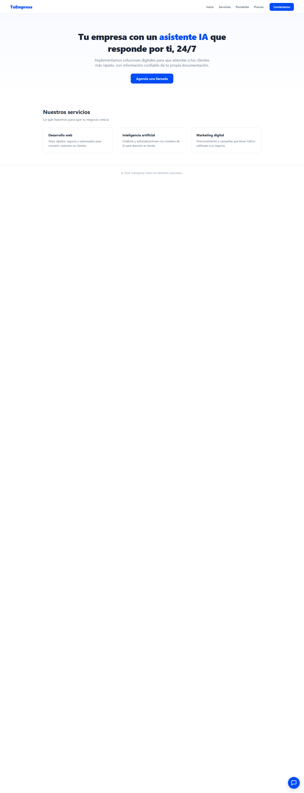
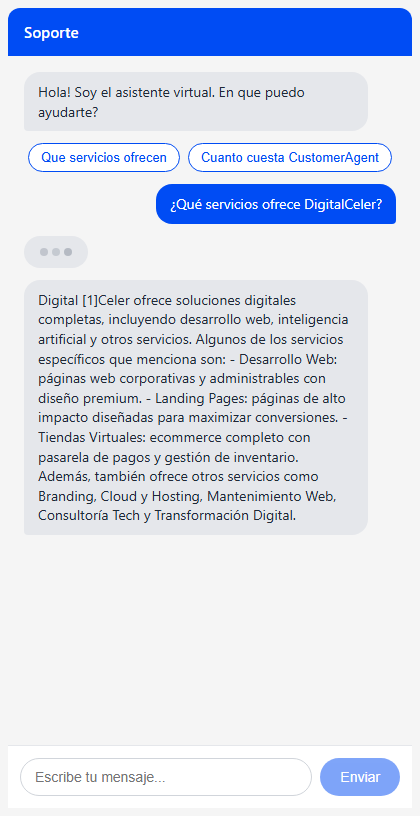
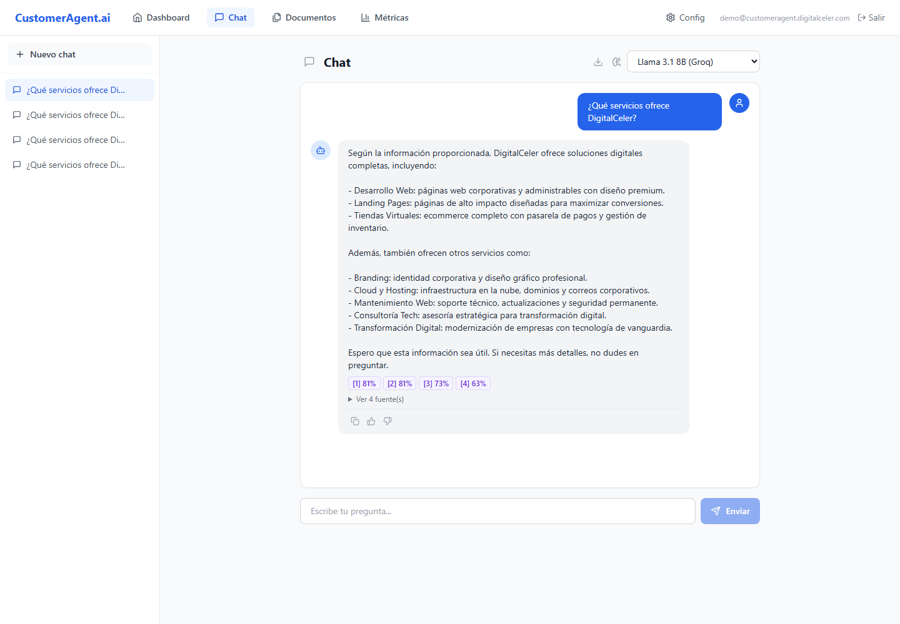
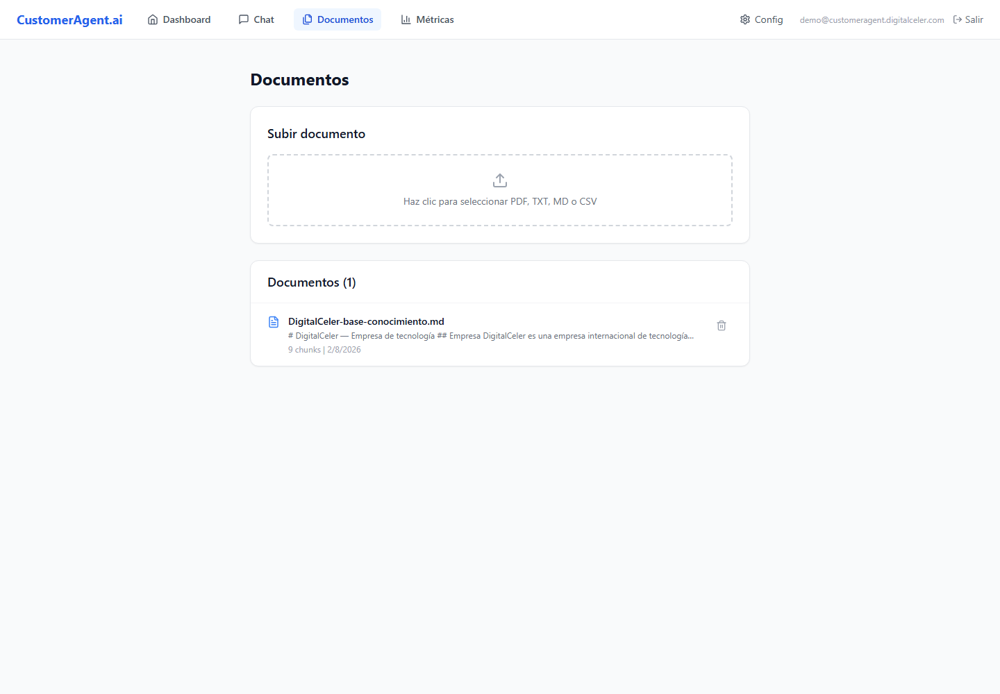
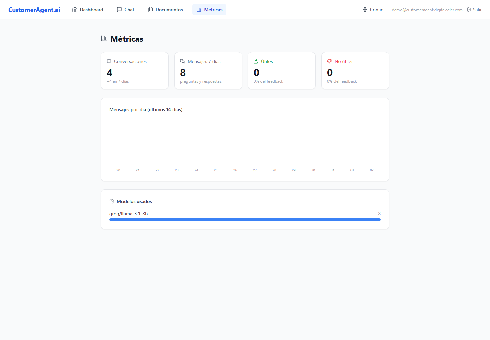
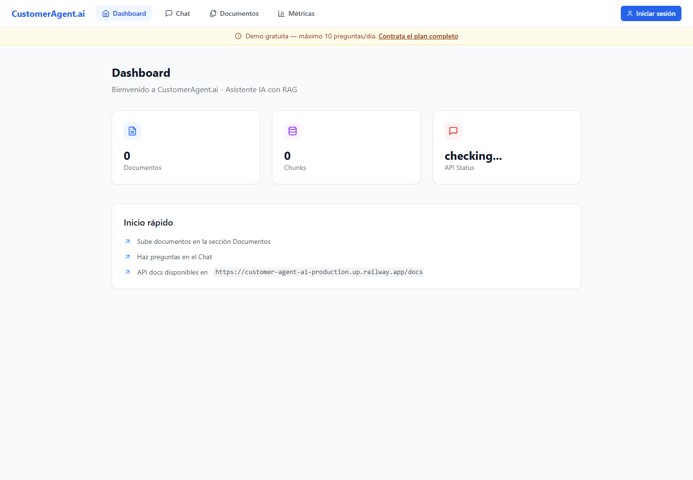

# CustomerAgent.ai — Asistente IA con RAG

[](https://customeragent.digitalceler.com)
[](https://customeragent-api.digitalceler.com/docs)
[](docs/arquitectura.md)

**CustomerAgent.ai** es un asistente virtual inteligente basado en **RAG (Retrieval-Augmented Generation)** que permite a empresas responder preguntas de sus clientes usando su propia documentación corporativa, sin alucinaciones y con fuentes verificables.

---

## 🧠 ¿Cómo funciona?

```
Usuario → Pregunta → Embeddings → Búsqueda semántica (pgvector) → Contexto relevante → LLM → Respuesta + Fuentes
```

1. El usuario hace una pregunta
2. Se genera un embedding vectorial de la pregunta (Gemini API)
3. Se buscan los fragmentos más relevantes en la base de datos vectorial (Supabase + pgvector)
4. El contexto encontrado se envía al LLM junto con la pregunta
5. El LLM genera una respuesta basada **solo** en el contexto proporcionado
6. Se muestran las fuentes utilizadas para generar la respuesta

---

## ✨ Características

| Característica | Detalle |
|---|---|
| **Modelos múltiples** | Groq (Llama 3.1, Llama 3.3, GPT-OSS), OpenAI (GPT-4o-mini), Gemini 1.5 Flash, Claude 3 Haiku |
| **Embeddings** | Gemini embedding-001 (gratis, 3072 dim) por defecto, OpenAI text-embedding-3-small como alternativa |
| **Vector DB** | Supabase + pgvector |
| **Formatos soportados** | PDF, TXT, MD, CSV |
| **Rate limiting** | 10 preguntas/día en demo, 500/día en el plan completo |
| **Persistencia** | Historial de conversaciones guardado en Supabase |
| **API REST** | Documentación interactiva con Swagger |
| **Frontend** | Dashboard, Chat con sidebar, Gestión de documentos |
| **Despliegue** | Backend en Railway, Frontend en Vercel |

---

## 🛠️ Stack tecnológico

### Backend
- **Python** + **FastAPI**
- **Supabase** + **pgvector** (base de datos vectorial)
- **Gemini API** (embeddings gratis) / **OpenAI** (embeddings alternativo)
- **Groq / OpenAI / Gemini / Claude** (LLMs)
- **Docker** (contenedorizado)

### Frontend
- **Next.js 14** + **TypeScript**
- **Tailwind CSS**
- **Lucide Icons**

---

## 🚀 Demo en vivo

Pruébalo ahora mismo sin registro:

[**👉 customeragent.digitalceler.com**](https://customeragent.digitalceler.com)

- 10 preguntas gratuitas por día
- Documentos de ejemplo precargados
- Selecciona entre 6 modelos de IA

---

## 📸 Capturas de pantalla

### Widget en tu web





### Panel de administración









---

## 📦 Planes disponibles

| Plan | Precio | Ideal para |
|---|---|---|
| **Demo** | Gratis | Probar el producto |
| **Membresía SaaS** | S/ 499 implementación + S/ 149/mes (≈ $135 USD + $40 USD/mes) | Usar el asistente sin preocuparte por la infraestructura |
| **Código completo** | USD 4,999 (pago único) | Desplegar en tu propia infraestructura con tus propias API keys |

La membresía incluye implementación del widget en tu web, alojamiento, acceso a todos los modelos de IA, hasta 500 preguntas/día, actualizaciones y soporte técnico continuo. Sin permanencia: pausa o cancela cuando quieras.

---

## 🏗️ Arquitectura

```
┌──────────────┐       ┌──────────────┐       ┌──────────────┐
│   Usuario     │──────▶│  Frontend    │──────▶│   Backend    │
│  (Web/Bot)    │       │  (Vercel)    │       │  (Railway)   │
└──────────────┘       └──────────────┘       └──────┬───────┘
                                                      │
                                            ┌─────────▼─────────┐
                                            │    Supabase +     │
                                            │     pgvector      │
                                            │  (Vector Store)   │
                                            └───────────────────┘
                                                      │
                                            ┌─────────▼─────────┐
                                            │  LLM Providers    │
                                            │  Groq · OpenAI    │
                                            │  Gemini · Claude  │
                                            └───────────────────┘
```

---

## 🔗 Enlaces

- **Demo**: [customeragent.digitalceler.com](https://customeragent.digitalceler.com)
- **API Docs**: [customeragent-api.digitalceler.com/docs](https://customeragent-api.digitalceler.com/docs)
- **Portafolio**: [digitalceler.com/es/portafolio](https://digitalceler.com/es/portafolio)
- **Contacto**: [digitalceler.com/contacto](https://digitalceler.com/contacto)

---

*Desarrollado por [DigitalCeler](https://digitalceler.com) — Tecnología que impulsa tu negocio.*
